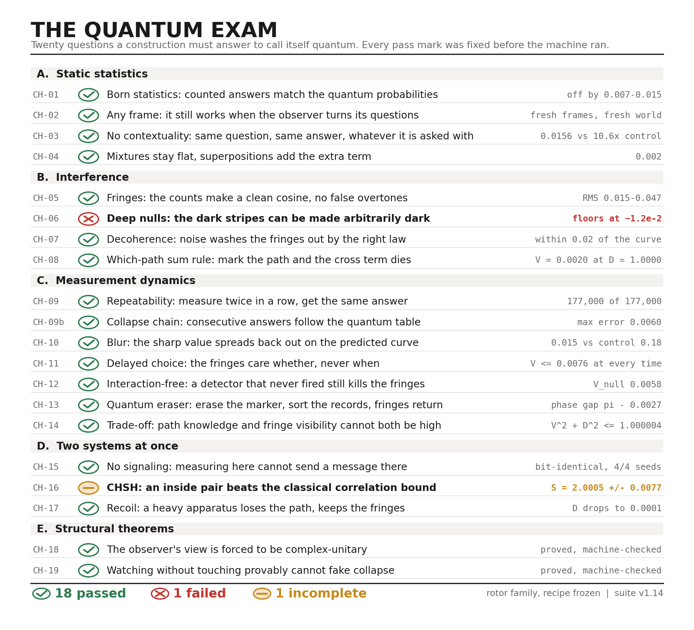
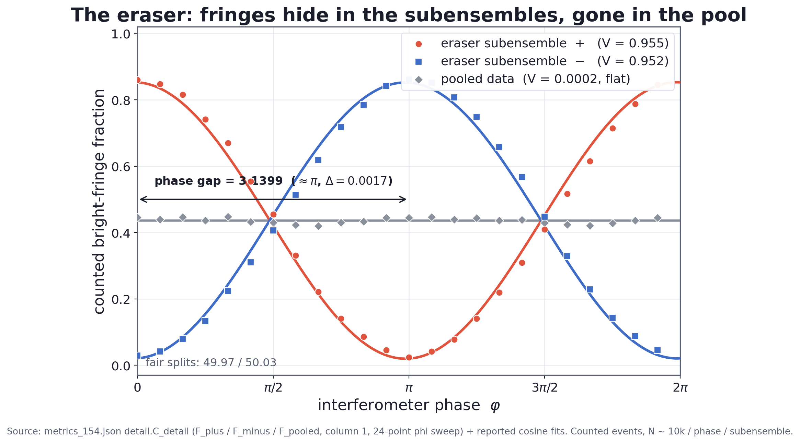
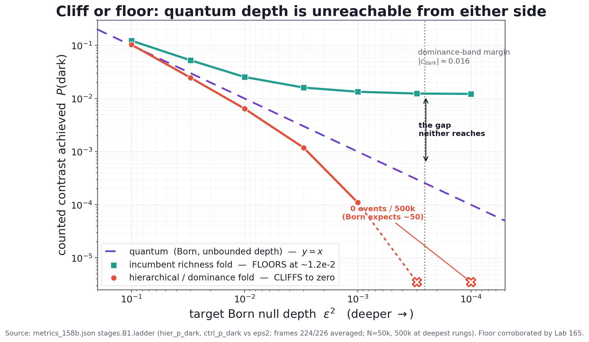

# The Machine Takes a Quantum Exam

*Quest for Entropy #3: twenty questions, one deterministic clockwork, and the two answers it could not give.*

<!-- The frozen conformance scorecard, suite v1.14. Eighteen passed, one failed, one unfinished. -->

Last time I took the machine apart. A pool of ninety-six rotors turning at speeds that never line up. A state of three numbers. And one move — **the fold** — where the observer compares three lengths, writes down which one won, and rewrites the state from six fresh rotor readings.

No dice. No collapse rule. No quantum formula anywhere inside it.

I said it comes out looking quantum. That is a big claim, and a claim like that is worth nothing until someone writes down what would prove it wrong. So we did. We wrote a twenty-question exam, fixed every pass mark before the machine ran, and made it sit the paper.

Here is the whole result, question by question. Including the one it failed.

## The question

What would it even mean for a machine to "be quantum"?

Not that it uses the quantum formula — this one never does. Not that it feels mysterious. The only test that means anything is behavioural: **put it through the things quantum systems do, and see if it does them too.**

So the question became a list. Twenty items. Not a vague vibe about weirdness, but twenty specific, countable behaviours with a number attached to each: Born statistics, interference with the right shape, the decoherence law, repeatability, delayed choice, the quantum eraser, no-signalling, the trade-off between knowing the path and seeing the stripes.

That list is the exam. It is the thing that can fail.

## The rules

An exam you write for your own machine is worth nothing unless the rules are strict. Ours:

**1. The exam was frozen first.** Every question and every pass mark was written down and version-stamped before the machine was pointed at it. The file has a changelog. You can read it.

**2. A mark may get harder, never softer.** If we found a bar too easy, we could tighten it. We could never loosen one because the machine missed it. One bar did change mid-campaign — question 17 — and I tell that story below, because the honest thing is that it changed *before* the first counting run, and it got harder.

**3. The recipe was frozen too.** The machine has one setting — the lean, the 2.5-to-1 from last episode. It was tuned once, against question 1 only. Then it was locked. Nothing was re-tuned between questions. A machine that gets re-adjusted for each question is not passing an exam, it is being coached.

**4. Every probability is counted, never computed.** The machine counts events. The quantum formula appears only afterwards, as a line on the chart to compare against. If the formula were inside the machine, the whole exercise would be a circle.

**5. Every question needs a control that fails.** A test that everything passes is not a test. So each question came with a deliberately broken version — a scrambled frame, a severed link, a fold switched off — and the broken version had to fail. If the control passed too, the question was measuring nothing and we threw it out.

**6. Then we did it all again on a different machine.** Nine of the questions were re-run on fresh frames, fresh seeds and a second substrate world, with the bars copied over word for word. That is the part I trust most.

## The run

**Eighteen passed. One failed. One we could not finish.**

| Section | Questions | Result |
|---|---|---|
| A. Static statistics | 4 | all passed |
| B. Interference | 4 | 3 passed, **1 failed** |
| C. Measurement dynamics | 7 | all passed |
| D. Two systems at once | 3 | 2 passed, **1 unfinished** |
| E. Structural theorems | 2 | both proved |

The failure is question 6, and it is the most valuable line in the table. The unfinished one is question 16, and it is unfinished in a specific way that I will show you rather than hide.

Now the whole paper.

## Part A — Does it get the numbers right?

**CH-01 · Born statistics.** The foundation. Quantum mechanics says the chance of an outcome is the squared length of its arrow. The machine never squares anything — it compares three lengths and keeps the winner. So: count tens of thousands of events and see where the frequencies land. They land on the quantum values, off by 0.007 to 0.015. Call it about one percent. Hold on to that number — the whole rest of this piece lives at that scale. **PASS.**

**CH-02 · Any frame.** A worry you should have: maybe we found one lucky set of questions for the observer to ask. So we turned the frame. Fresh directions, and then a fresh substrate world underneath. Same result. Not one lucky frame — the behaviour, not the setup. **PASS.**

**CH-03 · No contextuality.** In quantum mechanics, the answer to a question does not depend on which other questions you ask alongside it. That sounds obvious. It is not — it is a strong constraint, and it is the hinge Gleason's theorem turns on. We asked the same question inside many different groupings and measured the drift: 0.0156, at the machine's own one percent. The scrambled control drifted 10.6 times worse. **PASS.**

**CH-04 · Mixtures and superpositions.** Two setups. Flip a coin to pick one, and the statistics should be the plain average of the two — nothing extra. Combine them *coherently* instead, and an extra term must appear, of a size the theory pins down. The machine does both: flat on the coin flip to 0.002, and the extra term shows up at the predicted size. This is the difference between "don't know which" and "both at once", and the machine keeps them apart. **PASS.**

## Part B — Does it interfere?

**CH-05 · Fringes.** Point the machine at a two-path setup, sweep the phase, count. The counts trace a cosine — the real interference curve, RMS 0.015 to 0.047 away from the quantum one. And the shape is clean: no false overtones above the noise. Plenty of things can wiggle. Very few wiggle as a pure first harmonic. **PASS.**

**CH-06 · Deep nulls.** *The one it failed.* Full section below.

**CH-07 · Decoherence.** Add phase noise and interference should fade — not any old way, but along one specific curve. Turn the noise up and the machine's visibility follows that curve step for step, never more than 0.023 away from it. It loses coherence by the right law, not just in the right direction. **PASS.**

**CH-08 · The which-path sum rule.** Mark which path was taken, and interference must die completely: the two paths just add, no cross term. With full marking the machine's fringe visibility falls to 0.0020 while the path information reads 1.0000 — total knowledge, no stripes. **PASS.**

## Part C — Does measurement behave?

This is the section I care about most. Statistics can be faked by many things. *Dynamics* — what happens to a system after you look at it — is much harder to fake, and it is where our earlier attempts died.

**CH-09 · Repeatability.** Measure, then measure again immediately. Quantum mechanics says: certainty, the same answer. Not "usually" — always. The machine repeated 177,000 times out of 177,000, across two different worlds. Exactly 1.0. And nobody wrote a collapse rule; it falls out of the fact that the rewritten state leans toward what was just recorded. **PASS.**

**CH-09b · The collapse chain.** Harder version. Do not just re-measure — measure, let one tick pass, measure again, and check the *whole table* of transitions between the two, off-diagonal entries included. Quantum mechanics gives an exact table. The machine's counted table matches it: in every cell the worst entry stayed inside the bar we had set beforehand, and in the fresh second world the worst entry was off by 0.0060. This is the one that convinced me. Repeatability is one number and a lucky machine might hit it. A nine-entry table is not luck. **PASS.**

**CH-10 · Blurring back out.** After a measurement the answer is sharp. Wait without measuring and it should blur again — down a specific curve, with a dip and a partial revival. The machine follows that curve, revival included: RMS 0.018 or better against the free-evolution prediction. And against the control — the one that fakes it by measuring over and over, freezing the value instead of letting it move — the machine sits at least six times further away, in every cell we ran. Freezing a value and letting a value evolve look different, and the machine does the second one. **PASS.**

**CH-11 · Delayed choice.** Wheeler's question. Decide whether to check the path *after* the particle is already on its way. Quantum mechanics says the fringes depend on **whether** you check, never on **when**. So we slid the check up and down the timeline. Every marked run gave visibility 0.0076 or below, at every insertion point — while the same setup with nothing marking the path shows fringes at 0.99. Flat. No dependence on timing at all, and nothing here travels backwards in time. **PASS.**

**CH-12 · The detector that never fired.** The strangest one on the paper. Put a detector on one path. It does not fire — so the particle went the other way. Nothing touched it. And yet the fringes are gone, because the *possibility* of detection was enough. Learning something by not-seeing it still costs you the interference. The machine does this: fringe visibility on the non-firing runs sits at 0.0058, flat at the floor. **PASS.**

**CH-13 · The quantum eraser.** Mark the path, so the fringes die. Then erase the marker and sort the records into two piles by what the erased marker said. Fringes come back in each pile — and the two piles are exactly out of step with each other, so pooling them cancels back to nothing.

<!-- Lab 154, counted events. Two subensembles at full visibility, half a turn apart; everything together, flat. -->

The machine splits the records 49.97 to 50.03, brings both piles back at visibility 0.955 and 0.952, and puts them a phase gap of 3.1399 apart — that is pi, missed by 0.0017. Pooled together they flatten to 0.0002. It all reproduced later on fresh seeds. Nothing was un-measured here. The information was reorganised, and that is all the eraser ever was. **PASS.**

**CH-14 · The trade-off.** Path knowledge and fringe visibility cannot both be high — squared and added, they must not pass 1. The machine's counted values reach 1.000004 and no further, and it saturates the bound at full coupling, which is the interesting part: it does not sit safely below, it rides the edge exactly where quantum mechanics rides it. **PASS.** (This one also caught us out badly. See below.)

## Part D — Does it work with two systems?

**CH-15 · No signalling.** Two distant systems. Measuring one must not change what the other one sees — not "on average", not "approximately". We compared the remote record bit by bit and it stayed identical until the exact moment a signal travelling at the world's own light speed could have arrived. Four seeds out of four, plus a proof. **PASS.**

**CH-16 · CHSH.** *The one we could not finish.* Full section below.

**CH-17 · Recoil.** Sabine Hossenfelder's version of the double slit: the wall the slits are cut in gets a kick when a particle goes past, and that kick carries which-slit information. A light wall records the kick and the fringes die. A heavy wall barely moves, learns nothing, and the fringes survive. The machine reproduces both dials — the exchange ledger is exact every run, and as the apparatus gets heavier the recoverable path information falls to 0.0001 while the visibility holds. **PASS**, with one anomaly I will not paper over: at the extreme zero-mass end the visibility runs 0.017 higher than the reference curve, inside the bar but consistently, and it replicated on fresh seeds. We named it and carried it forward rather than rounding it away.

## Part E — Two things that are proved, not measured

Two rows are not experiments. They are theorems, machine-checked line by line.

**CH-18 · The dashboard is forced to be complex.** Physics students always ask why quantum mechanics needs imaginary numbers. This is a partial answer, at least for our observer: given a real, information-preserving view of a turning world with no standing still, the structure of that view *forces* a complex-unitary description. Not chosen for convenience. Forced by the geometry. **PROVED.**

**CH-19 · Watching is not enough.** This one is the wall that killed two years of ideas, and it is worth more than any pass on the list. Take any deterministic world. Watch it passively, through a fixed set of questions, changing nothing. Then the outcomes you record can always be arranged into one consistent joint story — which means they can never break the classical bounds that quantum mechanics breaks. **Passive observation of a deterministic world cannot fake collapse. Ever. It is a theorem.**

We ran into it as a measurement long before we proved it: a passively watched world scored 0.99963 against a classical ceiling of 1. Riding the limit, never crossing.

That is why the fold exists. Not because it was elegant — because everything gentler was ruled out.

## The one it failed

**CH-06. Can the dark stripes go arbitrarily dark?**

In an interference pattern the dark bands come from two contributions cancelling. Quantum mechanics allows perfect cancellation: line it up exactly and the darkness is *total*. Zero. And you can approach that zero as closely as you want.

Our machine cannot. Push toward a perfect null and the contrast stops falling. It flattens out at about 1.2 percent and stays there. There is always a little light left in the dark.

**Where does that floor come from?** From the same place everything else comes from: the fold rewrites the state from rotor readings, and those readings carry a small, structured leftover. That leftover is roughly the same size as the one percent we met back in question 1. The floor is not a bug we could patch. It is the price of the mechanism.

So we spent a campaign trying to get under it. Three routes:

**Change the reservoir.** Different pool, different statistics. The floor stayed.

**Change the coordinates.** If the leftover were an artifact of how we set things up, a symmetry transformation should smear it away. We twirled the whole system through a 24-element symmetry group. The leftover came back at 0.92 of its original size — essentially untouched. It is not a bookkeeping artifact.

**Change the architecture.** The last idea: fold in stages instead of all at once. We built it, certified it, and ran the same ladder — and it failed from **the opposite side.** Below a certain depth the hierarchical machine does not floor out. It snaps to exactly zero: 0 events out of 500,000 where quantum mechanics predicts about 50. Not too much light in the dark. *No* light at all, where there should be a little.

<!-- Lab 158b, counted events. The dashed line is what quantum mechanics does. Neither machine can follow it. -->

So the family has two shapes, and neither one is quantum:

> **Rich folds floor. Sharp folds cut off. Quantum mechanics does neither.**

We call it the **cliff-or-floor dichotomy**, and I want to be careful about its status: it is measured on both sides and named as a conjecture. It is not proved over every possible deterministic measurement machine. Proving it — or finding the machine that escapes it — is the open problem this whole programme now points at.

Here is why I am glad this row says FAIL.

A model that matches everything tells you nothing. This one makes a **prediction that could kill it**: if the world were a machine of this family, interference could not be made arbitrarily dark. It would bottom out around a percent, or drop off a cliff to nothing. Real quantum mechanics does neither, and experiments can look. The failure is the only place in twenty questions where this thing is properly falsifiable, and that makes it the best row on the paper.

## The one we could not finish

**CH-16. Can a pair of observers inside the machine break the classical correlation bound?**

This is Bell's test, run from the inside. Two observers, two settings each, four correlations added up into a number called S. Any classical local story is stuck at S = 2. Quantum mechanics reaches 2.83. We wanted our embedded pair above 2.5.

We got **S = 2.0005, plus or minus 0.0077.**

Look closely at that number. It is not a failure to correlate — it is the classical ceiling, hit exactly. All the controls behave: cut the link between the pair and it drops to 0.002, and every no-signalling and swap-intervention check came back clean, the largest at 0.006 against a bar of 0.019. The machine extracts every last drop a local story allows, and not one drop more.

And the reason is not mysterious, which is why this row says *unfinished* rather than *failed*. To run the test cleanly we imposed guardrails from a critical review: each observer's fold may see only its own setting, and the settings must not depend on the world's state. Those guardrails are correct — without them you can fake a Bell violation trivially, and our own earlier one-bit toy did exactly that by quietly routing both settings into the same place. But with them in force, the pair is mathematically factorised, and then S at most 2 is a **theorem**. We spent the run measuring a ceiling we had already proved.

So the honest report is: this configuration cannot violate Bell, we know why, and the number confirms it precisely. Going further needs a substrate whose dynamics depend on both settings at once while the local statistics stay flat. That is allowed by our rules — the hidden machinery here is global, which is exactly how it lives with Bell's theorem. But it touches the foundations of the model, so it is gated behind design review, not something to bolt on for a nicer scorecard.

Eighteen out of twenty, with one honest cliffhanger. I would rather print that than a twenty.

## Where the referee caught us

Five times during this exam the machine looked wrong and *we* were wrong. I am listing them because a scorecard without them is not evidence, it is advertising.

**1. We tested the wrong thing.** Question 10 failed on its first run. Before recording the failure we re-read the protocol and found we had compared against the wrong reference curve. The test was void — not the machine. Corrected and re-run, it passed.

**2. Our tool was broken, not the machine.** Questions 13 and 14 both failed hard. The cause was the *marker* we were measuring with: a crude thing we had never certified. That exposed a real gap — the machine had no certified way to measure a two-outcome subsystem at all. So we built one, certified it on its own terms, and only then re-ran the questions. Both passed. A failed test is only as good as the instrument that produced it.

**3. We ran quantum mechanics through our own marking scheme, and quantum mechanics failed too.** Question 14 came back 0.015 *over* the bound — which would have been a genuine departure from quantum mechanics, the biggest result on the paper. Before claiming it, we fed real quantum-mechanical data through the identical scoring code. It scored the same excess. Our scoring quantity was not the one the physics defines. We fixed the estimator, re-ran, and got 1.000004 — inside, as it should be. That is the closest we came to publishing something false.

**4. We carried a setting where we should have re-fitted one.** Question 12 passed at home and missed on fresh frames. Cause: we reused the old recipe on the new frames instead of re-fitting it. And the size of the miss matched, almost exactly, a transfer penalty we had measured independently in the same battery. Re-fitted properly, it passed.

**5. We wrote a bar that measured two things at once.** Question 17's original one-line pass mark mixed up two different dials: how strongly the apparatus couples, and how heavy it is. Visibility and path information move opposite ways on the first dial and the same way on the second, so one bar could not score both. We caught it, split it into two, and — this is the part that matters — did it **before** the first counting run, and it came out harder. Written down, dated, on the record.

Every one of these is on the record with a number attached — four as numbered entries in the honesty ledger, the fifth as a dated, versioned change to the exam itself. Not the tidy version of the story: the actual one.

## The Confession

Every episode gets one. Here it is.

**We wrote the exam.** Twenty questions I chose, with pass marks I set. Nobody handed us this paper. The best I can say is that the rules above are real — frozen first, harder-only, controls that must fail, re-run on a second world — and that the file is public with its changelog intact, so you can check whether a bar ever moved the convenient way. It never did. But it is our exam, and you should weigh it as such.

**The questions are not independent.** Several of them lean on the same one move. When the fold works, a whole block of rows passes together. So "eighteen out of twenty" is not eighteen separate pieces of evidence. It is closer to a handful of mechanisms, each visible from several angles.

**Twenty questions is not quantum mechanics.** There is no spin, no identical particles, no field theory, no gravity. This is one small machine with three outcomes and two observers on its best day. The exam only says: within these twenty behaviours, at about one percent, it did what a quantum system does.

**And there is the one percent itself.** Every "pass" on this paper is a pass at that precision. Question 6 is where that one percent stops being a tolerance and becomes a wall: the place the machine cannot follow quantum mechanics no matter how hard we push. Same number, twice. Once as the error bar, once as the limit.

What I will stand behind is narrow and, I think, still worth something: **a fully deterministic machine, with a physical measurement and no formula inside it, reproduced eighteen quantum behaviours at one percent — and where it broke, it broke in a way you can go and measure.**

## What this does NOT claim

> This is a **demonstration**, not a discovery about nature. The scorecard says one family of machines, at one frozen setting, reproduced twenty specific behaviours — it does not say our universe is a clockwork, does not reinterpret quantum mechanics, and does not dodge Bell's theorem, since the hidden machinery here is *global*, not local. Question 16 is unfinished, not won: the certified pair sits exactly on the classical bound. Question 6 is a confessed failure, and the cliff-or-floor dichotomy is a named conjecture, measured on both sides and proved on neither. Every number here is at the machine's own precision, about one percent, and every pass means "within that".

## The neighbors

Test-driven design for physics models is not something I invented — it is just software practice pointed at a different target, and the honest note from episode one still holds: the reading and cross-checking was done mostly by AI, with me steering. The individual questions come from the people who first thought to ask them: John Wheeler's [delayed-choice experiment](https://en.wikipedia.org/wiki/Wheeler%27s_delayed-choice_experiment) is question 11, Marlan Scully and Kai Drühl's [quantum eraser](https://en.wikipedia.org/wiki/Quantum_eraser_experiment) is question 13, Berthold-Georg Englert's [visibility-distinguishability relation](https://doi.org/10.1103/PhysRevLett.77.2154) is the exact form of question 14, Elitzur and Vaidman's [interaction-free measurement](https://arxiv.org/abs/hep-th/9305002) is question 12, and Sabine Hossenfelder's slit-recoil argument shaped question 17. Question 3 exists because of [Gleason's theorem](https://plato.stanford.edu/entries/qt-gleason/), and question 19 is a Leggett-Garg wall — the tool [Leggett and Garg](https://doi.org/10.1103/PhysRevLett.54.857) built to ask whether a system has definite values when nobody looks. The exam is theirs. Only the machine sitting it is ours.

## Run it yourself

Every row on the scorecard, with the protocol, the frozen pass mark, the measured numbers and the control that had to fail, is written up one file per question: **[github.com/masteris777/quest-for-entropy-quantum-exam](https://github.com/masteris777/quest-for-entropy-quantum-exam)** — twenty deep dives, `test01.md` through `test20.md`, plus the raw measurement files the lab wrote and a checker that re-reads every number quoted in this post and fails loudly if one has drifted. Run `python verify_scorecard.py`. The machine itself is in the [previous episode's repository](https://github.com/masteris777/quest-for-entropy-the-machine), where `python run_all.py` rebuilds it from scratch in two seconds. And you can still poke it in the browser: **[run the machine](https://quest-for-entropy.web.app/the-machine)**, or **[watch the fold kill the stripes](https://quest-for-entropy.web.app/stripes-die)** — that one is question 8, live. Archived, citable snapshot: DOI to-be-minted-at-publication (Zenodo).

## How this was made

I'm a software architect. The physics and the deep math are what I'm curious about, not my job, and I use AI to explore them. The honest split: the heavy lifting — the math, the physics checks, the code, the sums — is AI, with me setting the direction, asking the questions, and making the calls. Main models: Anthropic Fable 5 and Sonnet 5, with help from OpenAI GPT 5.6 Sol, DeepSeek v4 Pro, and Google Gemini 3.1. To keep us honest, the work runs through a harness I built: every experiment follows rules fixed in advance, results get challenged by independent AI review, and every mistake we catch — including the five in this post — goes into a public honesty ledger. Every number here comes from code you can run, not from a model's memory.

## Next time

Episode four: **it started with a break shot.** Long before any of this, I was watching balls scatter on a pool table and wondering how far ahead anyone could really predict them. That question turned out to have a sharp answer, and the answer is why chaos — the obvious candidate for making a quantum-looking world — is the first machine in the graveyard.

---

*Quest for Entropy is written by Marijus Masteika. Entropy was always the dark horse for me — connected to information, and maybe hiding answers to everything. That's the quest.*
